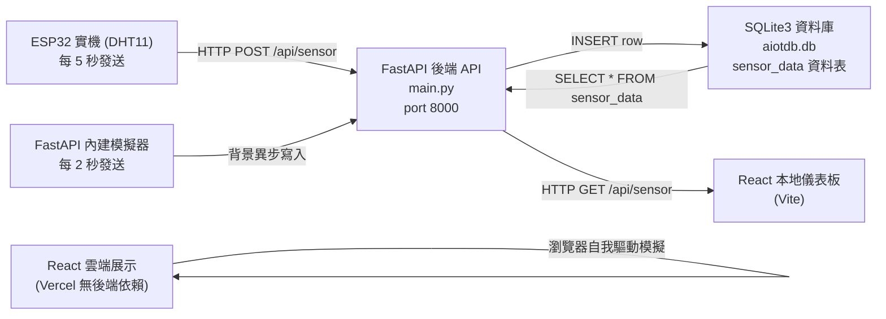
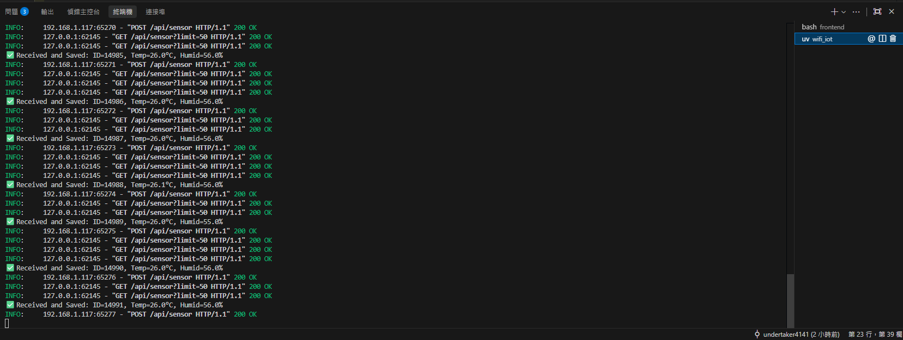
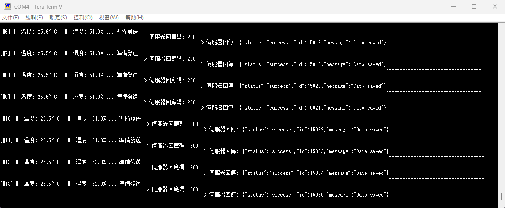
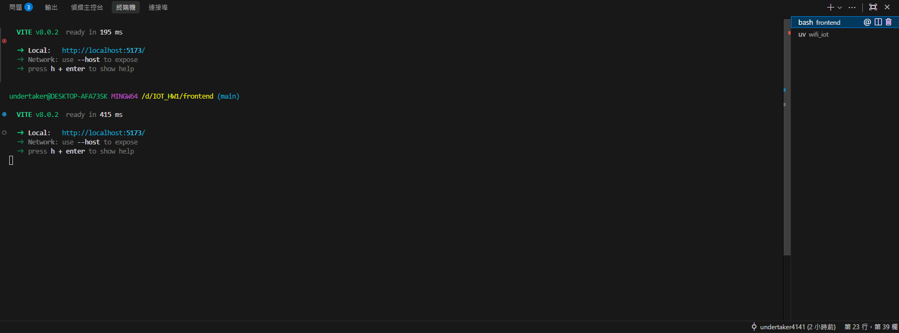
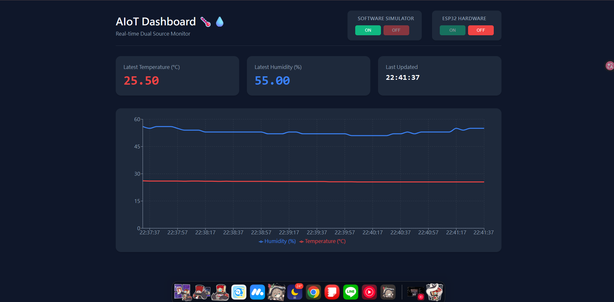
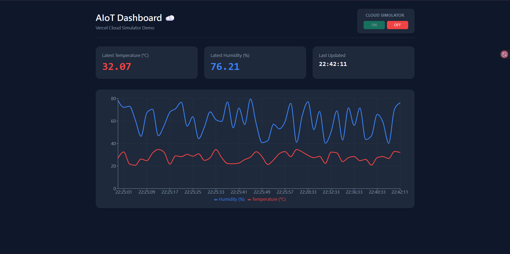

# HW1 AIoT 系統實作專題報告：雙軌架構下之邊緣端感測與雲端展示系統
**4112064230 電資三 王珈源**

專案目錄 (Project Directory): `d:\IOT_HW1\`

展示連結 (Live Demo): [https://iot-hw-1.vercel.app/](https://iot-hw-1.vercel.app/)

展示影片 (Demo Video): [https://youtu.be/\_8iFi2bmKJ0](https://youtu.be/_8iFi2bmKJ0)

---

## 架構總覽 (Architecture Overview)




---

## 步驟 1 — 核心檔案建立與架構 (File Creation)

本系統的核心分為硬體端、後端與前端，建立於 `d:\IOT_HW1\`：

| 檔案/目錄 | 用途說明 |
|---|---|
| `backend/wifi_iot/main.py` | FastAPI REST API — 接收溫濕度 POST 請求、控制模擬器、存取 SQLite |
| `backend/wifi_iot/aiotdb.db` | SQLite3 本地關聯式資料庫 |
| `edge/DHT11_WIFI/src/main.cpp` | ESP32 C++ 程式碼 — 讀取 DHT11 並透過 WiFi 發送 JSON 負載 |
| `frontend/` | React (Vite) 前端 — 輪詢地端 FastAPI 獲取真實數據並繪製圖表 |
| `frontend_vercel/` | React 雲端前端 — 移除 API 依賴，於背景安全生成模擬數據供 Vercel 展演 |
| `backend/wifi_iot/requirements.txt` | Python 後端相依套件清單 |

### `main.py` — API 端點設計 (Endpoints)

| 方法 (Method) | 路由 (Route) | 描述 (Description) |
|---|---|---|
| GET | `/api/sensor?limit=10` | 取得最近的溫濕度感測資料 (預設 10 筆) |
| POST | `/api/sensor` | 接收來自 ESP32 的溫濕度 JSON 負載並存入資料庫 |
| POST | `/api/simulator/on` | 啟動後端背景模擬器 (自動停止接收 ESP32) |
| POST | `/api/simulator/off`| 停止後端背景模擬器 |
| POST | `/api/esp32/on` | 允許接收實機 ESP32 資料 (自動停止模擬器) |
| POST | `/api/esp32/off` | 拒絕接收實機 ESP32 資料 |

### ESP32 發送負載 (JSON Payload)
```json
{
  "temp": 24.5,
  "humid": 60.1
}
```

---

## 步驟 2 — 安裝相依套件 (Dependency Installation)

**後端 (Python)**
指令：
```powershell
cd backend/wifi_iot/
pip install -r requirements.txt
```
安裝結果：成功安裝 `fastapi` 與 `uvicorn` (ASGI 伺服器)。

**前端 (Node.js)**
指令：
```powershell
cd frontend/
npm install
```
安裝結果：成功安裝 React, Vite, Recharts 等前端視覺化與構建套件。

---

## 步驟 3 — 初始化 SQLite3 資料庫 (Database Initialization)

FastAPI 在啟動時會透過 `@app.on_event("startup")` 觸發 `init_db()`，自動建立 `aiotdb.db` 與 `sensor_data` 資料表。

資料表結構 (Schema)：
```sql
CREATE TABLE IF NOT EXISTS sensor_data (
    id          INTEGER  PRIMARY KEY AUTOINCREMENT,
    temp        REAL     DEFAULT 0.0,
    humid       REAL     DEFAULT 0.0,
    created_at  DATETIME DEFAULT (datetime('now', 'localtime')),
    updated_at  DATETIME DEFAULT (datetime('now', 'localtime'))
);
```

---

## 步驟 4 — 啟動 FastAPI 伺服器 (FastAPI Server Started)

指令：
```powershell
cd backend/wifi_iot/
uv run -m uvicorn main:app --host 0.0.0.0 --port 8000 --reload
```

輸出結果：
```
INFO:     Uvicorn running on http://0.0.0.0:8000 (Press CTRL+C to quit)
INFO:     Started reloader process [12345] using StatReload
📦 Database initialized at d:\IOT_HW1\backend\wifi_iot\aiotdb.db
INFO:     Application startup complete.
```



---

## 步驟 5 — 啟動 ESP32 與背景模擬器 (ESP32 / Simulator Started)

本系統具備兩種資料來源切換能力：

**情境 A：實機硬體 ESP32 (預設開啟)**
將程式燒錄至 ESP32 後，裝置會每 5000 毫秒讀取一次 DHT11，並向 `http://<YOUR_IP>:8000/api/sensor` 發送 POST 請求。
終端機顯示：
```
✅ Received and Saved: ID=1, Temp=24.5°C, Humid=60.1%
✅ Received and Saved: ID=2, Temp=24.6°C, Humid=59.8%
```

ESP32 展示 : 


ESP32 UART 數據 :


**情境 B：啟動內部非同步模擬器**
發送 POST 至 `/api/simulator/on` 後，FastAPI 背景的 `simulation_loop()` 會接管數據生成，每 2 秒產生一筆資料：
```
🔄 Simulated Data Saved: Temp=28.45°C, Humid=55.12%
🔄 Simulated Data Saved: Temp=27.10°C, Humid=62.30%
```

---

## 步驟 6 — 驗證資料庫寫入 (SQLite3 DB Inserts Verified)

呼叫 API 驗證資料提取：
```powershell
curl http://127.0.0.1:8000/api/sensor?limit=3
```

回傳結果 (Response)：
```json
{
  "status": "success",
  "data": [
    {"id": 3, "temp": 28.45, "humid": 55.12, "created_at": "2026-03-30 15:32:00", "updated_at": "2026-03-30 15:32:00"},
    {"id": 2, "temp": 24.6,  "humid": 59.8,  "created_at": "2026-03-30 15:31:55", "updated_at": "2026-03-30 15:31:55"},
    {"id": 1, "temp": 24.5,  "humid": 60.1,  "created_at": "2026-03-30 15:31:50", "updated_at": "2026-03-30 15:31:50"}
  ]
}
```

---

## 步驟 7 — 啟動 React 前端儀表板 (React Dashboard Started)

指令：
```powershell
cd frontend/
npm run dev
```

輸出：
```
  VITE v5.x.x  ready in 350 ms

  ➜  Local:   http://localhost:5173/
  ➜  Network: http://192.168.x.x:5173/
```


顯示 :


---

## 步驟 8 — 系統全功能驗證

1. **本地端 Dashboard (`frontend`)：** 讀取 SQLite 歷史軌跡，並利用 `Recharts` 繪製動態折線圖，每 2 秒發起 fetch 輪詢進行畫面 reload。並透過運作狀態指示燈標示當下驅動來源。
   

2. **雲端 Live Demo (`frontend_vercel`)：** 成功於 Vercel 部署。前端網頁利用 `useEffect` 與 `setInterval` 於背景產生 20°C~35°C 之間、濕度 40%~80% 之亂數，自我驅動亂數圖表。
   


---

## 最終狀態總結 (Final Summary)

| 元件 (Component) | 狀態 (Status) | 服務位址 (URL) |
|---|---|---|
| FastAPI 後端API | 運行中 | `http://<本機IP>:8000` |
| SQLite3 資料庫 | 寫入中 | `backend/wifi_iot/aiotdb.db` |
| ESP32 實體感測器 | 發送中 | 每 5 秒發送實測數據 |
| React 本地儀表板 | 運行中 | `http://localhost:5173` |
| React Vercel 展示 | 已上線 | `https://iot-hw-1.vercel.app/` |

---

## Re-run Commands


```powershell
# 終端機 1 — 啟動 FastAPI 後端伺服器
cd d:\IOT_HW1\backend\wifi_iot\
uv run -m uvicorn main:app --host 0.0.0.0 --port 8000 --reload

# 終端機 2 — 啟動 React 本地前端
cd d:\IOT_HW1\frontend\
npm run dev
```
*(ESP32 硬體只需接上電源，並確認與電腦連接至同一 WiFi 網段即可)*

---

## Notes & Observations

- **時間戳記處理：** 本專案利用 SQLite 內建的 `datetime('now', 'localtime')` 自動處理時間，減輕了 FastAPI 與 ESP32 的時間同步負擔。
- **未來展望：** 目前使用 HTTP 進行通訊，若未來系統規模擴大，可考慮將架構升級為 MQTT 協定以達到更低功耗傳輸，並將 SQLite 遷移至 Supabase 實現全雲端化。